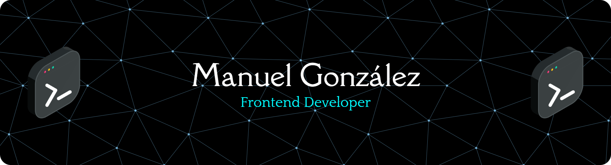

<h1 align="center">Bienvenid@, soy Manuel González 👋</h1>

🧑‍💻 Desarrollador Web | Frontend | Prototipador UI/UX

---

### 🧠 Sobre mí

Profesional con más de **10 años trabajando en proyectos digitales**, especializado en desarrollo frontend, diseño responsivo y prototipado.  
He aprendido de manera **autodidacta y colaborativa**, desarrollando soluciones que combinan diseño, funcionalidad y una excelente comunicación con equipos de trabajo y clientes.  
Me apasiona todo lo que tenga relación con el **Frontend**, en especial el **prototipado, diseño responsivo y estructuras escalables**.

---

  

---

### 💼 Experiencia profesional

- 👨‍💻 Desarrollo de mantenedores (CRUD), validaciones, consumo de APIs REST.
- 🧪 Pruebas unitarias con Jest para componentes de frontend
- 📐 Desarrollo de estructuras responsivas para interfaces web.
- 🔍 Solución de errores y depuración de programas.
- ⚙️ Trabajo en equipo, control de versiones con Git, metodologías ágiles.

#### 🏢 Empresas con las que he trabajado:

- Clínica Alemana  
- BCI  
- ENEL  
- ARAUCO  
- PF Alimentos  
- CMPC  
- ORIENCOOP  
- Universidad de Talca

---

### 🧠 Lenguajes de programación

- JavaScript (ES5, ES6+), TypeScript, CoffeeScript  
- C#, PHP

---

### 🌐 Frameworks y bibliotecas

- Angular, React, React Native, Vue.js, Astro
- ASP.NET, CodeIgniter, jQuery  
- Bootstrap (con experiencia usando Less y Stylus), Material Design, DaisyUI, HeroUI, Tailwind

---

### 🗃️ Bases de datos

- MySQL, SQL Server, Oracle SQL Developer

---

### 🎨 Desarrollo Web

- HTML5, CSS3, diseño web adaptable (responsive)  
- Sistemas de diseño (Design Systems)  
- WordPress (creación de sitios, gestión de plugins, SEO básico)  
- Gestión de dominios y hosting con cPanel

---

### 💻 Desarrollo y metodologías

- Programación Orientada a Objetos (POO)  
- Consumo de APIs REST  
- Desarrollo y depuración de software  
- Mejora continua del producto basado en feedback del usuario

---

### 🛠️ Herramientas y tecnologías

- Visual Studio, Visual Studio Code  
- Node.js  
- Git, GitHub, GitLab  
- Microsoft Office, Figma, Postman

---

### ✍️ Últimos proyectos / ideas

- 🎨 **Dashboard con Vue 3 + Vuetify 3** para proyectos ambientales: filtros, agrupación de datos y visualización con gráficos.
- 🛒 **Maqueta de productos de tienda online con Astro**: Imagenes, descripción, botones funcionales.
- 🔧 **Creación de SAO (Sistema de Administración de Orquestador)**  para Universidad en su administración de intranet.
- 🔧 **Desarrollo de interfaces y funcionalidad** en https://gadmin.app y desarrollo de editor para creación de tiendas online.

---

### 📫 Contacto

- 🌍 Vive en Chile 🇨🇱  
- 🌐 manuelgonzalezm2016@gmail.com

---

### 🔥 Estadísticas de GitHub

  
   
  

